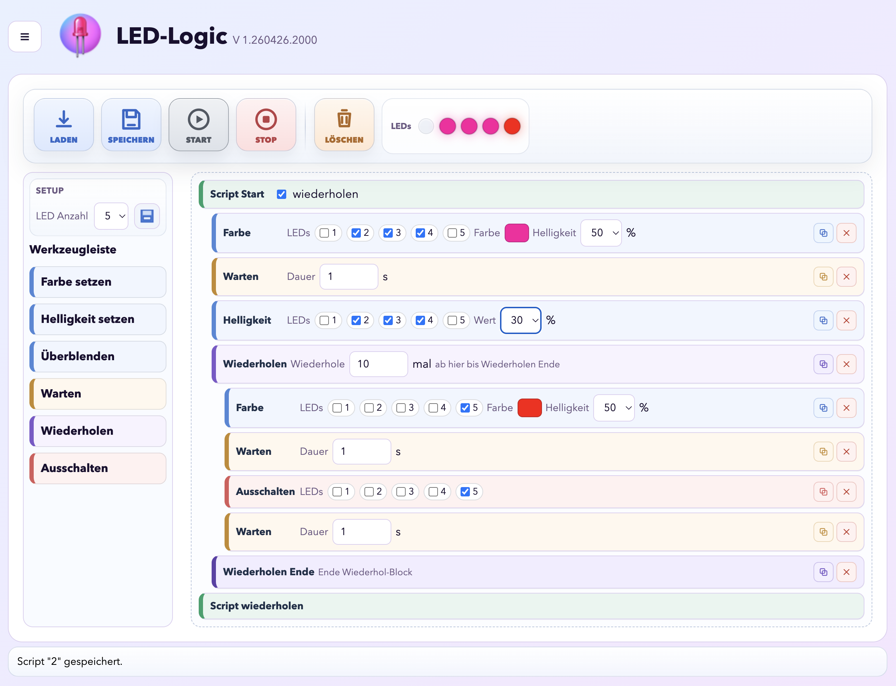

# LEDLogic

## English

LEDLogic is a web-based LED controller for ESP32 with WS2812 LEDs.
The focus is on simple visual programming of LED sequences directly in the browser.

### What the Program Does

- Controls a WS2812-LED strip via ESP32 (data pin GPIO 5).
- Provides a visual script interface with drag-and-drop functionality.
- Executes LED actions as sequences and allows saving, starting, stopping, and clearing sequences.
- Shows an LED simulation in the toolbar for immediate visual feedback of script behavior.

### LED Control in Detail

- LED count is configurable (1 to 12).
- Each script step offers various actions including:
	- Set color
	- Set brightness
	- Fade (blend)
	- Wait
	- Repeat block (start/end)
	- All off
- Colors can be set via a color wheel or hex text input.
- Script sequences can be repeated as loops.

### Web-UI



- Top action bar with:
	- Save
	- Start
	- Stop
	- Clear
- Status display for running/stopped scripts.
- LED simulator next to buttons for quick visual control.

### Build and Flash

```bash
pio run
pio run -t upload
pio device monitor
```

### Note on WiFi, Captive Portal, and OTA

WiFi configuration, captive portal, and OTA updates are still included in the project but are not the main focus of LEDLogic. These features are collected on the configuration page.

---

## Deutsch

LEDLogic ist eine webbasierte LED-Steuerung für ESP32 mit WS2812-LEDs.
Der Fokus liegt auf einer einfachen visuellen Programmierung von LED-Abläufen direkt im Browser.

### Was das Programm macht

- Steuert einen WS2812-LED-Strip über den ESP32 (Daten-Pin GPIO 5).
- Bietet eine visuelle Script-Oberfläche mit Drag-and-Drop.
- Führt LED-Aktionen als Ablauf aus und kann den Ablauf speichern, starten, stoppen und löschen.
- Zeigt eine LED-Simulation in der Toolbar, damit das Script-Verhalten sofort sichtbar ist.

### LED-Steuerung im Detail

- LED-Anzahl ist einstellbar (1 bis 12).
- Pro Script-Schritt stehen unter anderem folgende Aktionen zur Verfügung:
	- Farbe setzen
	- Helligkeit setzen
	- Überblenden (Fade)
	- Warten
	- Repeat-Block (Start/Ende)
	- Alles aus
- Farben können über ein Farbrad oder per Hex-Textfeld gesetzt werden.
- Script-Ablauf kann als Loop wiederholt werden.

### Web-UI


- Obere Aktionsleiste mit:
	- Speichern
	- Start
	- Stop
	- Löschen
- Zustandsanzeige für laufendes/gestopptes Script.
- LED-Simulator neben den Buttons zur schnellen visuellen Kontrolle.

### Build und Flash

```bash
pio run
pio run -t upload
pio device monitor
```

### Hinweis zu WLAN, Captive Portal und OTA

WLAN-Konfiguration, Captive Portal und OTA-Update sind weiterhin im Projekt vorhanden, stehen bei LEDLogic aber nicht im Vordergrund. Diese Funktionen liegen gesammelt auf der Konfigurationsseite.
